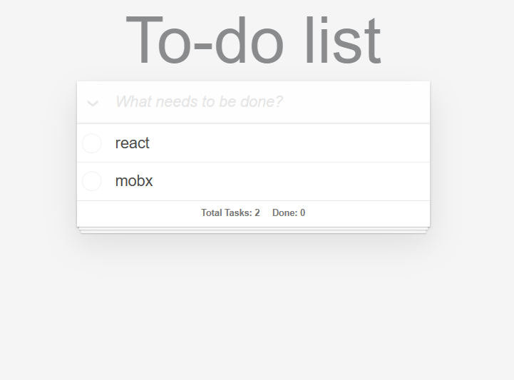
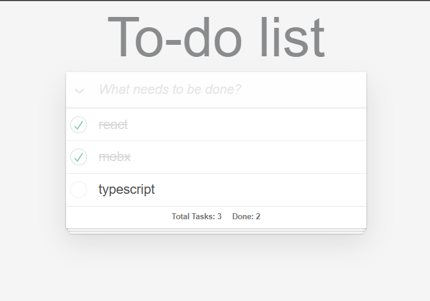
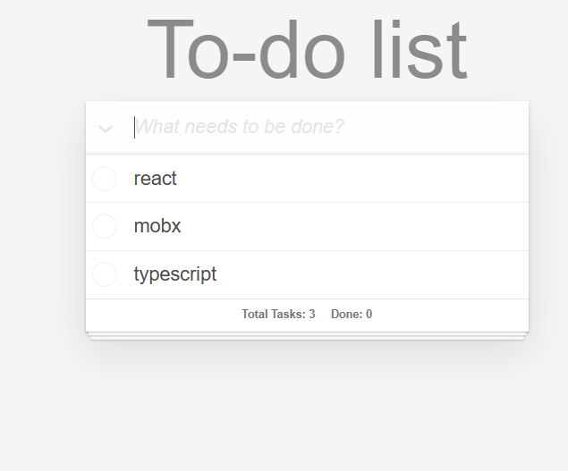

# React-Mobx-Todo-List

## 技术栈：

React、React Hooks、Javascript 、CSS、Mobx

## 功能列表

1. 列表渲染
2. 单选实现
3. 全选实现
4. 删除功能
5. 新增功能
6. 统计计数

## 预览

## 用法：

#### yarn (安装依赖)

#### yarn start

Runs the app in the development mode.
Open http://localhost:3000 to view it in your browser. The page will reload when you make changes. You may also see any lint errors in the console.

#### yarn test

Launches the test runner in the interactive watch mode. See the section about running tests for more information.

#### yarn build

Builds the app for production to the build folder.
It correctly bundles React in production mode and optimizes the build for the best performance.
The build is minified and the filenames include the hashes.
Your app is ready to be deployed!
## 相关知识

- 双向绑定

主流的mvc(vm)框架都实现了单向数据绑定，即数据(model)变化主动触发ui(view)变化

双向绑定是一种数据绑定方式，它允许视图（View）和数据模型（Model）之间的数据同步更新。当一个数据模型发生变化时，视图会自动更新，反之亦然。

在双向绑定中，数据模型和视图之间是双向的，即数据模型可以更新视图，视图也可以更新数据模型。这样，当用户在视图中进行操作时，数据模型也会相应地更新，反之亦然。

在Web开发中，双向绑定通常用于前端框架（例如Angular、React、Vue等）中，以简化视图和数据模型之间的同步操作。通过双向绑定，开发人员可以更轻松地管理视图和数据模型之间的数据交互，减少代码量，提高开发效率。

例如，在一个双向绑定的输入框中，当用户输入内容时，数据模型会自动更新，同时当数据模型的值发生变化时，输入框中的内容也会自动更新。这样，开发人员不需要手动处理数据和视图之间的同步操作，从而可以更专注于业务逻辑的开发。

- Hook

它是一种函数式编程的方式来编写React组件，相较于传统的类组件，React Hook 具有以下几个优点：

简洁：使用 Hook 编写组件的代码通常比使用类组件要更简洁，因为 Hook 可以将状态管理和副作用分离成独立的函数，并且可以在不引入类组件的情况下管理组件的状态和行为。

更好的代码复用：React Hook 具有更好的代码复用性，因为它们可以在组件之间共享状态和行为逻辑。

没有 this：使用 Hook 可以避免类组件中 this 指向的问题，避免了 this 指向错误导致的调试困难。

更容易进行代码分割：使用 Hook 编写的组件可以更容易地拆分成更小的、更可重用的组件。

更少的模板代码：在类组件中，每个状态都需要定义一个 state，每个事件处理函数都需要手动绑定 this。在使用 Hook 的函数式组件中，这些模板代码可以被省略。

- 箭头函数

箭头函数是ES6引入的一种新的函数语法，相较于传统的函数定义方式，箭头函数具有以下几个好处：

1.简洁明了：箭头函数的语法非常简洁，可以用更少的代码来表达同样的逻辑。

2.更简单的this绑定：在箭头函数中，this关键字会自动绑定到定义该函数的作用域中，而不是调用它的作用域中。这意味着在箭头函数中，this关键字不会被动态绑定，从而减少了this指向错误的概率。

3.更好的作为回调函数：由于箭头函数的简洁性和this绑定的特性，它们通常比传统函数更适合用作回调函数。

4.隐式返回值：当函数体只有一条语句时，箭头函数可以省略花括号和return关键字，直接返回该条语句的值。这种语法简化了代码，使代码更易读。

5.更短的函数声明：箭头函数在定义时可以省略function关键字，使得函数声明更加简洁。箭头函数特别适用于简单的函数和回调函数，以及需要简洁代码结构和减少冗余代码的场景。

- Class类三种函数
  - get函数 
    不能传参，函数内可以用this关键字获取实例属性，需要通过实例对象调用 (如u.userImg)
    注意：调用函数时不需要加括号()
  - 普通函数  
    可以传参，函数内可以用this关键字获取实例属性，需要通过实例对象调用 (如u.getUserName(obj)
  - 静态(static)函数 
    可以传参，函数内this关键字指向类(即 User)，因此不能用this关键字获取实例的属性 
    需要通过类名直接调用 (如User.getUserType(obj, 1)) 
    注意： 
         (1)通过类名直接调用，不能通过实例对象调用 
         (2)静态函数中的this指向类(即 User)，this只能调用静态方法和静态属性
